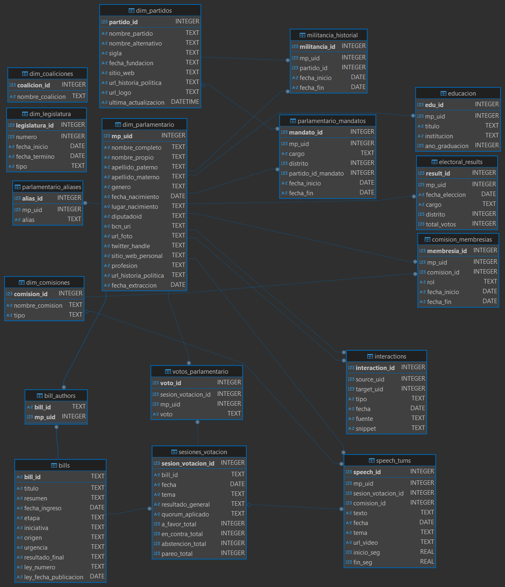

# Prototipo de Chatbot sobre Actividad Parlamentaria en Chile

Este proyecto tiene como objetivo construir y alimentar un sistema de chatbot capaz de responder preguntas complejas sobre la actividad de los diputados y diputadas de Chile. Para lograrlo, se ha diseñado un proceso automatizado que extrae, unifica y estructura datos de múltiples fuentes públicas.

El núcleo del sistema es una base de datos relacional que integra toda la información bajo un identificador único por parlamentario (`mp_uid`), permitiendo cruzar datos de votaciones, proyectos de ley, discursos e interacciones políticas. Este repositorio de datos sirve como la base de conocimiento para un chatbot con capacidades de **RAG (Retrieval-Augmented Generation)**.

-----

## 📁 Estructura del Repositorio

El proyecto se organiza en una estructura modular para separar la lógica de extracción de datos (`etl`), el código fuente principal (`core`, `app`), los datos y la documentación.

```
prototype-diputados-chatbot/
│
├── data/
│   ├── database/
│   │   └── parlamento.db       # Base de datos SQLite generada.
│   ├── docs/
│   │   └── schema.sql          # Definición formal del esquema de la BD.
│   └── xml/
│       └── legislaturas.xml    # Respaldo XML para el ETL de legislaturas.
│
├── src/
│   ├── app/
│   │   └── app.py              # (Pendiente) App web del chatbot con Streamlit.
│   ├── core/
│   │   └── alias_resolver.py   # (Pendiente) Módulo para normalizar nombres.
│   └── etl/
│       ├── etl_roster.py       # ETL para parlamentarios y partidos.
│       ├── etl_bills.py        # ETL para proyectos de ley y sus autores.
│       ├── etl_votes.py        # ETL para sesiones de votación y votos individuales.
│       └── etl_legislaturas.py # ETL para el historial de legislaturas.
│
├── .gitignore
├── create_database.py          # Script para inicializar la BD desde schema.sql.
├── PLANNING.md                 # Planificación y seguimiento del proyecto.
├── README.md                   # Esta documentación.
└── reports.ipynb               # Notebook para visualizar el estado de la BD.
```

-----

## 🗃️ Base de Datos: `parlamento.db`

El corazón del proyecto es la base de datos `parlamento.db`, diseñada para centralizar toda la información. Su estructura, definida en `data/docs/schema.sql`, se organiza en módulos lógicos para mayor claridad y escalabilidad.

  * **Módulo 1: CORE - Entidades Principales**: Contiene las tablas dimensionales que describen a los actores y conceptos fundamentales.

      * `dim_parlamentario`: Tabla maestra con el perfil biográfico de cada parlamentario. Genera el `mp_uid` que es la clave central del sistema.
      * `dim_partidos`: Catálogo de partidos políticos, enriquecido desde la BCN.
      * `dim_legislatura`: Catálogo histórico de todas las legislaturas del Congreso.

  * **Módulo 2: TRAYECTORIA POLÍTICA**: Registra el historial y los cargos de los parlamentarios.

      * `parlamentario_mandatos`: Almacena cada período legislativo servido por un parlamentario.
      * `militancia_historial`: Registra la trayectoria de afiliaciones políticas.

  * **Módulo 3: ACTIVIDAD LEGISLATIVA**: Registra los eventos y artefactos del proceso legislativo.

      * `bills`: Almacena la información de cada proyecto de ley (título, resumen, estado, etc.).
      * `bill_authors`: Vincula cada proyecto de ley (`bill_id`) con sus parlamentarios autores (`mp_uid`).
      * `sesiones_votacion`: Guarda los metadatos de cada votación (fecha, tema, resultado general).
      * `votos_parlamentario`: Registra cada voto individual, vinculando a un parlamentario (`mp_uid`) con una sesión (`sesion_votacion_id`) y su decisión.

  * **Módulo 4: ACTIVIDAD PÚBLICA**: Captura discursos e interacciones del debate público (tablas `speech_turns` e `interactions`, actualmente pendientes de ETL).

-----




## ⚙️ Descripción de los Módulos de Código

Los scripts en Python son responsables de recolectar, procesar y cargar los datos en la base de datos.

  * **`create_database.py`**: Es el primer script a ejecutar. Lee el archivo `schema.sql` y crea la estructura vacía de la base de datos `parlamento.db`.

  * **Scripts ETL (`src/etl/`)**:

      * `etl_roster.py`: Puebla las tablas `dim_parlamentario`, `dim_partidos`, `parlamentario_mandatos` y `militancia_historial` extrayendo datos de la API de la Cámara y la BCN.
      * `etl_bills.py`: Extrae datos de la API de la Cámara para poblar las tablas `bills` y `bill_authors`.
      * `etl_votes.py`: Depende de los dos scripts anteriores. Obtiene las votaciones de los proyectos de ley existentes y carga los datos en `sesiones_votacion` y `votos_parlamentario`.
      * `etl_legislaturas.py`: Puebla la tabla `dim_legislatura` con el historial completo de períodos legislativos, usando un XML local como respaldo.

